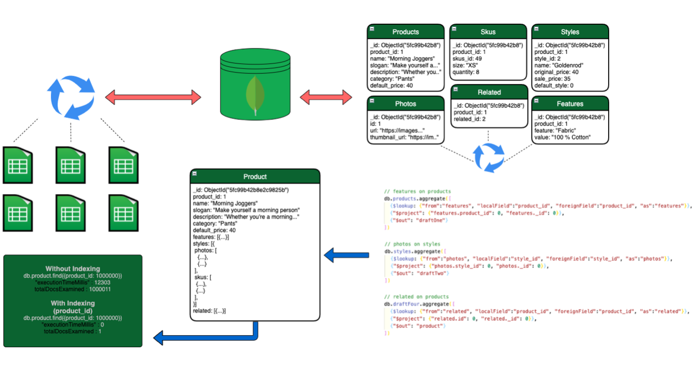
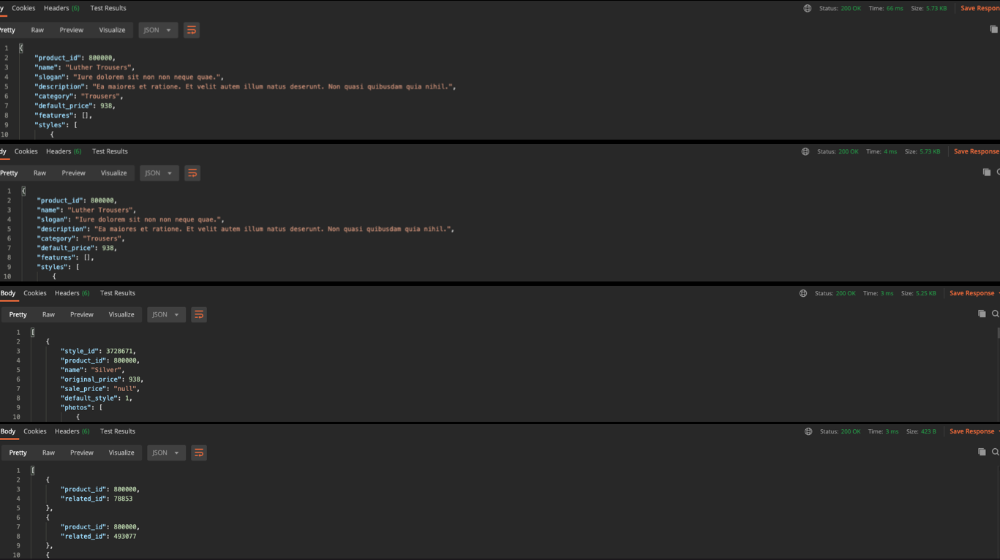
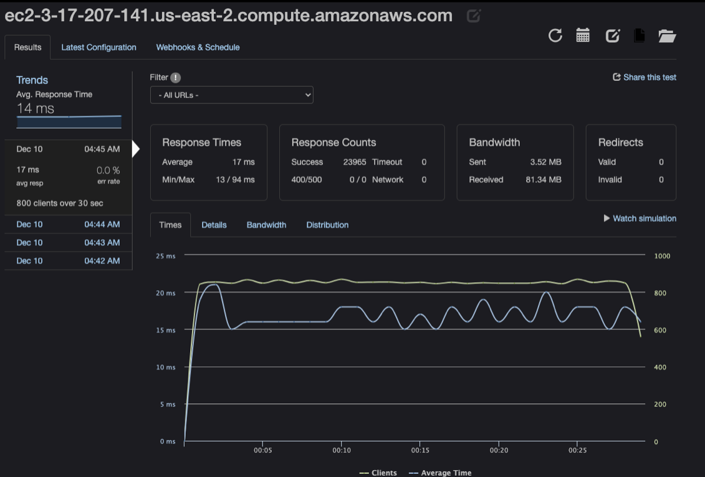

# Project Catwalk - Back-end service for Legacy Front-end Retail Web Application

I was responsible for building out the products Back-end service for the product
detail page.

Performed ETL on 6.5gb of messy CSV file data. Used Node to parse the files,
clean the data, then merge each file into a collection. Performed an aggregation
of all CSV files into a single Mongo collection to improve query read time.

Reduced server response time from 66ms down to 3ms by using Redis to cache
previous data.

Average response time 14ms under a load of 800 requests per sec.

## Tech Stack

- [Node](https://nodejs.org/en/)
- [Express](https://expressjs.com/)
- [AWS](https://aws.amazon.com/)
- [MongoDB](https://www.mongodb.com/)
- [Docker](https://www.docker.com/)
- [Redis](https://redis.io/)

## Team

- Dylan Allgood - Product Back-end Service
  - https://github.com/dylanallgood
  - www.linkedin.com/in/dylanallgood
